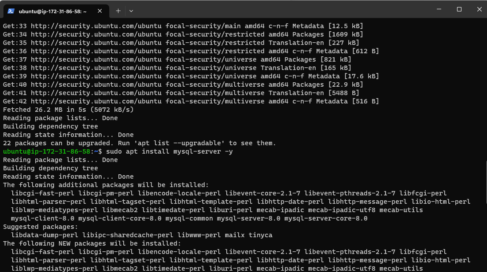
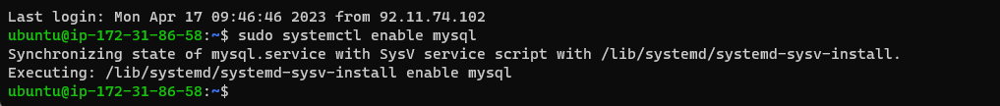
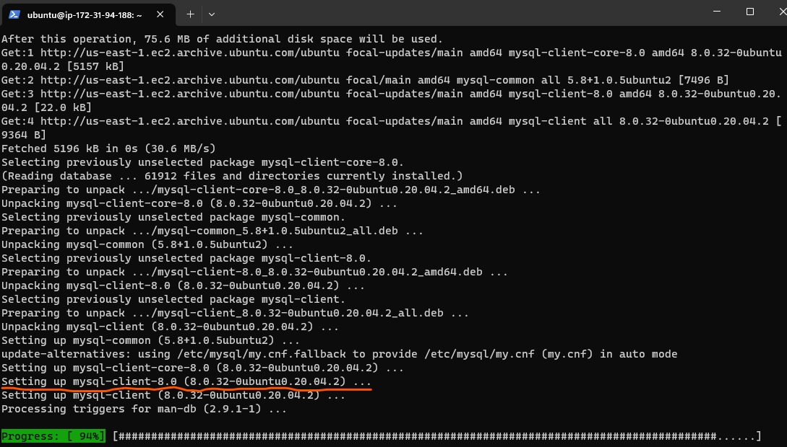
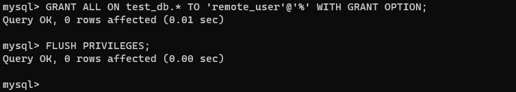
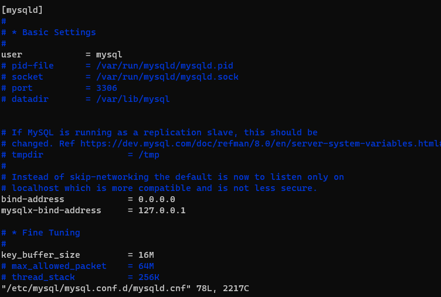
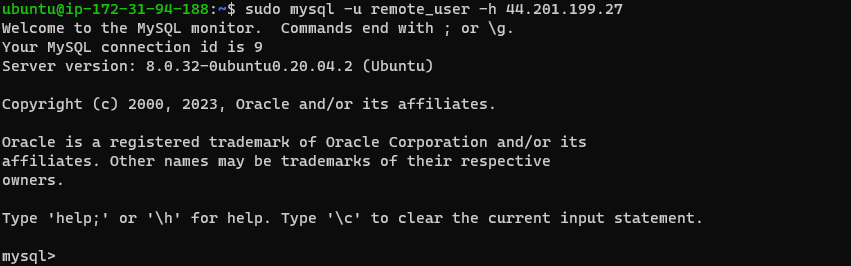
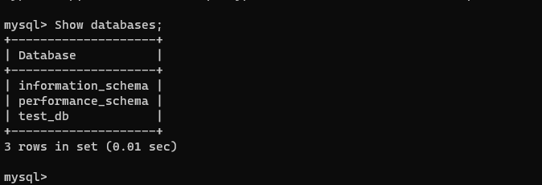

## **Documentation for Project 5**

### Installing MySQL Server 
`sudo apt install mysql-server -y`

### Enabling MySQL Server 
`sudo systemctl enable mysql`

### Installing MySQL Client 
`sudo apt install mysql-client -y`

### Creating DB User and Database
`CREATE USER 'remote_user' @ '%';`

`CREATE DATABASE 'test_db';`

### Granting and Flushing Privileges 
`GRANT ALL ON test_db.* TO 'remote_user'@'%' WITH GRANT OPTION;`

`FLUSH PRIVILEGES;`

### Binding IP Address
`sudo vi /etc/mysql/mysql.conf.d/mysqld.cnf`

### Connecting to Mysql server from Mysql Client
`sudo mysql -u remote_user -h 44.201.199.27`

### Showing databases Created on Server
`Show Databases;`

### Displaying List of Users from Server
`select user,host from mysql.user;`

